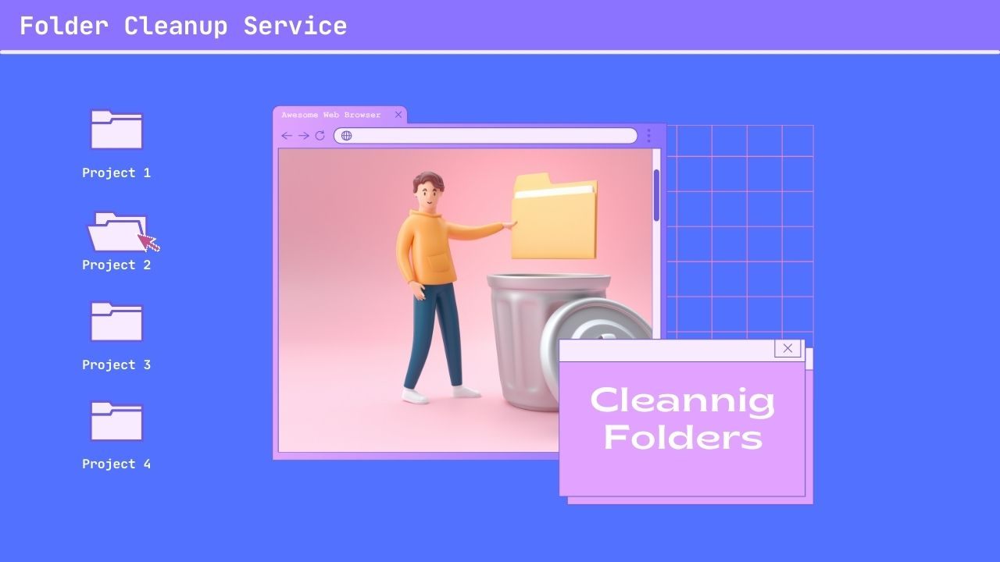

# ⚙️ Serviço de Limpeza de Diretórios para Runners



## 📝 Descrição

Este serviço .NET realiza a limpeza automática de diretórios especificados, mantendo apenas o número configurado de subdiretórios mais recentes em cada um. É ideal para uso em ambientes de integração contínua, onde há necessidade de remover builds antigos e economizar espaço em disco.

## 🛠️ Configuração

### 📄 Arquivo de Configuração

Configure o serviço no arquivo `appsettings.json`:

- `DirectoryPaths`: Lista de caminhos de diretórios a serem monitorados.
- `KeepRecentFoldersCount`: Número de subdiretórios mais recentes a manter.

Exemplo de `appsettings.json`:

```json
{
  "FolderCleanup": {
    "DirectoryPaths": [
      "C:\\path\\to\\directory1",
      "C:\\path\\to\\directory2"
    ],
    "KeepRecentFoldersCount": 10
  }
}
```

## 📦 Build do Projeto

- Instale o .NET SDK correspondente à sua versão de desenvolvimento nesse caso foi `.net 7.0`.
- Abra o prompt de comando e navegue até a raiz do projeto.
- Execute `dotnet publish -c Release` para compilar o projeto.
- Copie os arquivo gerados de dentro da pasta `bin/Release/net7.0/win-x64/publish` para dentro da pasta que desejar no servidor.

## ⏱️ Agendamento do Serviço

- Pressione `Win + R`, digite `taskschd.msc` e pressione "Enter".
- Clique em "Criar Tarefa..." no painel de ações.
- Na aba "Geral":
  - Insira um "Nome" e uma "Descrição".
  - Marque a opção "execute se o usuário estiver conectado ou não".
  - Marque "executar com previlegios"
- Em "Disparadores", defina o "horário" e a "frequência" de execução.
- Em "Ações", aponte para o executável do serviço e coloque o path da pasta raiz em "Iniciar Em".
- Ajuste as configurações de segurança conforme necessário.

## 📑 Logs

O serviço possui um arquivo de log que fica dentro da pasta raiz. Esse arquivo e reescrito a cada execução.

Arquivo: `./log.txt`